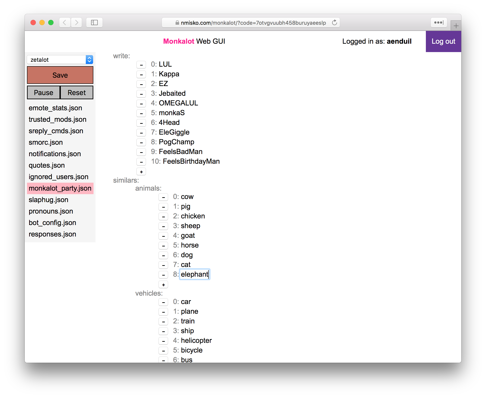

```diff
- UNMAINTAINED - PROBABLY NOT COMPATIBLE TO CURRENT TWITCH API
```

# monkalot-ui
Provides a web interface to manage [monkalot](http://www.github.com/nmisko/monkalot) relatively comfortably.

+ Start monkalot with REST api enabled. E.g. `./monkalot.py -p 8080`, if you want it to run on port 8080.
+ Replace the `localhost:8081` at the top of [monkalot.js](scripts/app/monkalot.js) with the url of your monkalot webserver.
+ Replace the client_id in [monkalot_web.js](scripts/app/monkalot_web.js) with your client_id.
+ Make sure your client_id redirects to the url this site is hosted on (https://dev.twitch.tv/dashboard/apps).
+ Disable Cross-Origin-Restrictions for testing purposes if the monkalot REST api runs on a different url than this site.



